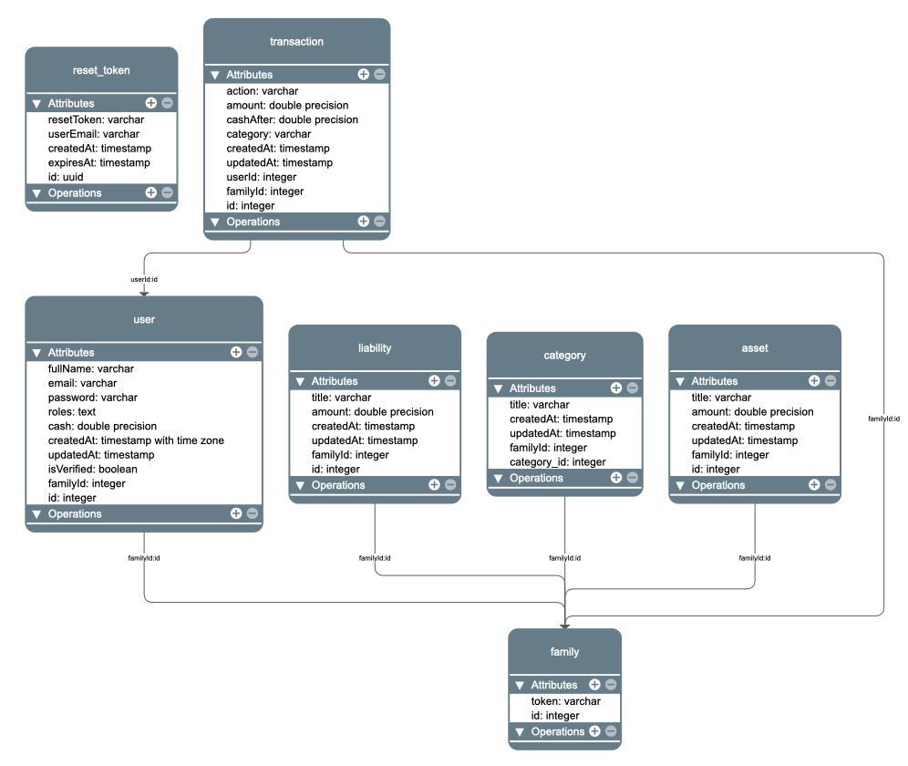
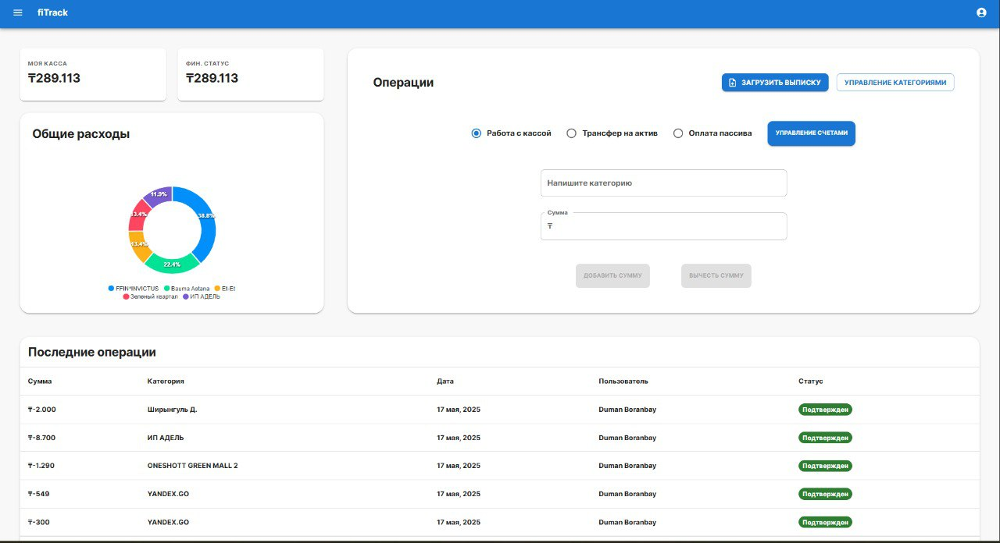
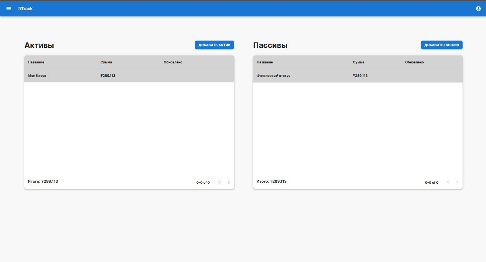
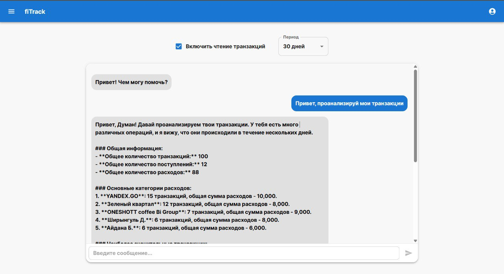
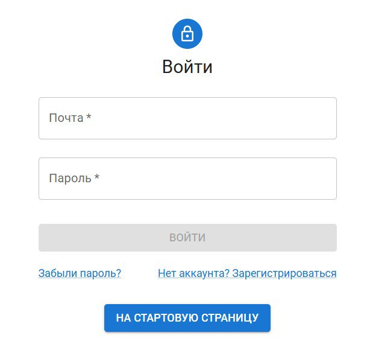
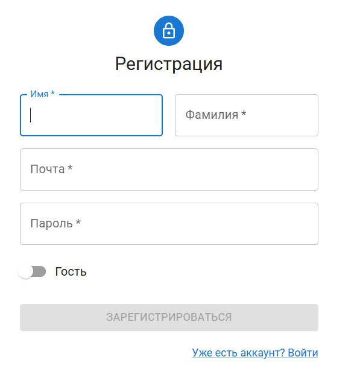
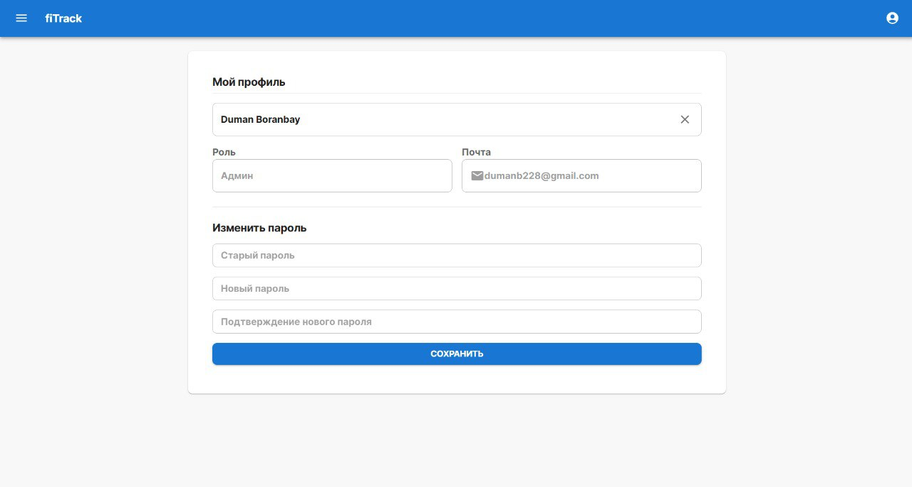
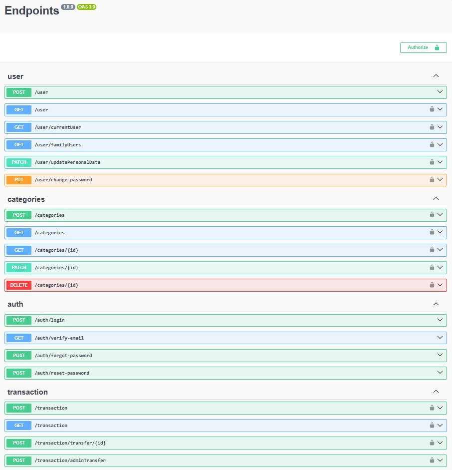
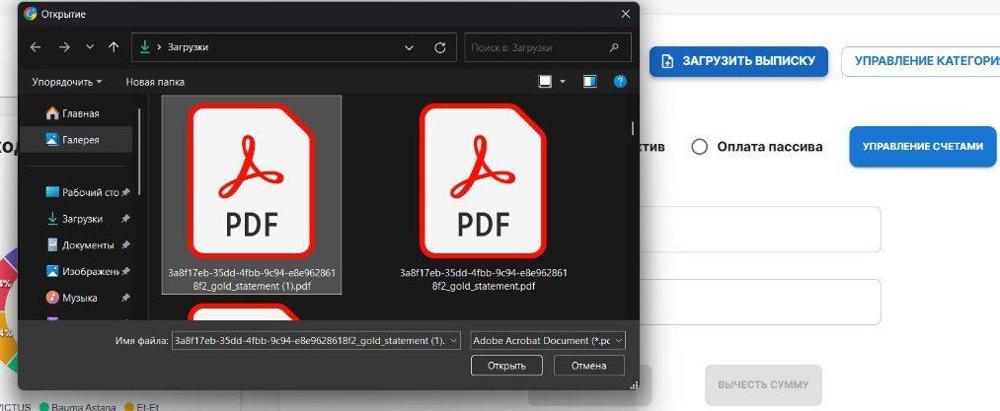

<!-- <p align="center">
  
</p> -->

<h1 align="center">FiTrack</h1>

<p align="center">
  Personal finance management platform with AI-powered insights
</p>

<p align="center">
  <a href="https://fitrack.kz">Website</a> •
  <a href="https://fitrack.kz/api/docs">API Docs</a> •
  <a href="./docs/thesis.pdf">Thesis Paper</a>
</p>

---

> **Note**: Services are currently offline due to hosting payment issues.

## Overview

FiTrack is a personal finance management platform that combines expense tracking, net worth monitoring, and AI-powered financial insights. The system automates transaction import from PDF bank statements and provides personalized recommendations through a GPT-4o mini chatbot.

## Repositories

This project consists of three independent services:

| Repository | Description | Tech Stack |
|------------|-------------|------------|
| [fitrack-backend](https://github.com/F11eyaz/fitrack_back) | backendBackend API for financial data management and AI chatbot | NestJS, PostgreSQL, TypeORM |
| [fitrack-frontend](https://github.com/F11eyaz/fitrack_front) | Web application and user interface | React, Redux Toolkit, Material UI |
| [fitrack-parser](https://github.com/F11eyaz/fitrack_bs_parser) | PDF bank statement processing service | Python, FastAPI, pdfplumber |

Each repository contains its own README with setup instructions and documentation.

## Architecture

```
┌─────────────────────────────────────────────────────────────────┐
│                         React Frontend                          │
│                      (fitrack.kz:3000)                          │
└────────────────────────────┬────────────────────────────────────┘
                             │ HTTPS/REST
                             │
┌────────────────────────────▼────────────────────────────────────┐
│                       NestJS Backend API                        │
│                      (fitrack.kz:3003)                          │
│                                                                 │
│  ┌──────────┐  ┌──────────┐  ┌──────────┐  ┌──────────┐         │
│  │   Auth   │  │Transaction│  │  Asset   │  │ Chatbot  │        │
│  │   JWT    │  │   CRUD    │  │Liability │  │ GPT-4o   │        │
│  └──────────┘  └──────────┘  └──────────┘  └──────────┘         │
│                                                                 │
└────────────────────┬───────────────────────┬────────────────────┘
                     │                       │
                     │                       │ HTTP
                     │                       │
                     │              ┌────────▼────────┐
                     │              │  PDF Parser     │
                     │              │  (FastAPI)      │
                     │              │  Port 8000      │
                     │              └────────┬────────┘
                     │                       │
                     ▼                       ▼
            ┌────────────────────────────────────┐
            │         PostgreSQL Database        │
            └────────────────────────────────────┘
```

## Database Schema

<p align="center">
  
</p>

## Features

**Transaction Management**  
Track income and expenses with automatic categorization. Import transactions from PDF bank statements (currently supports Kaspi Bank format).

**Net Worth Tracking**  
Monitor assets (cash, investments, property) and liabilities (loans, credit cards) with real-time net worth calculation.

**AI Financial Assistant**  
Chat with GPT-4o mini for personalized insights about spending patterns, budget recommendations, and financial analysis over 7, 30, or 90-day periods.

**Family Budgets**  
Create shared budget groups with role-based permissions for collaborative financial management.

**Multi-Platform**  
Web application with full PWA support and iOS compatibility through Capacitor.

## Documentation

- [API Documentation](https://fitrack.kz/api/docs) - Interactive Swagger UI
- [Thesis Paper](./docs/FiTrack_thesis.pdf) - Complete academic documentation
- [Database Diagram](./assets/4.3.png) - PostgreSQL schema

## Screenshots

### Dashboard & Transactions

<p align="center">
  
</p>

### Assets and Liabilities

<p align="center">
  
</p>

### AI Financial Assistant

<p align="center">
  
</p>

### Authentication and Profile

<p align="center">
  
  
</p>

<p align="center">
  
</p>

### API & Statement Upload

<p align="center">
  
</p>

<p align="center">
  
</p>

## Getting Started

To run the project locally, follow the setup instructions in each repository:

1. [Backend Setup](https://github.com/F11eyaz/fitrack_back#getting-started)
2. [Frontend Setup](https://github.com/F11eyaz/fitrack_front#getting-started)
3. [Parser Setup](https://github.com/F11eyaz/fitrack_bs_parser#getting-started)

## Tech Stack

**Backend:** NestJS, TypeScript, PostgreSQL, TypeORM, Passport JWT, LangChain, OpenAI GPT-4o mini

**Frontend:** React, TypeScript, Redux Toolkit, Material UI, Capacitor, Axios

**Parser:** Python, FastAPI, pdfplumber, psycopg2

## Project Context

This project was developed as a bachelor's thesis at Astana IT University, Department of Computing and Data Science (June 2025).

**Development Team:**
- Duman Boranbay - Complete system implementation, thesis and technical documentation
- Alisher Galymzhan - Thesis and technical documentation
- Damir Nygmetollauly - Thesis and technical documentation, iOS PWA conversion

**Academic Supervisor:**
- Anar Rakhimzhanova

## License

Academic project - Astana IT University

## Contact

Questions or feedback: @takitakirrumba (telegram)
